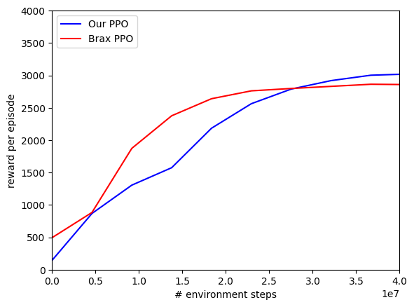

# PPO-Brax-Equinox

Near-SOTA PPO implementation with Jax+Brax+Equinox

### List of features
* **Minimal use of external functions:** meaning that all the nitty-gritty details of PPO are implemented. Have you ever wondered how to a implement a running mean/std normalization?
* **It's a bicycle:** well, yeah, there is a bunch of implementations out there that do things better. But, there are none that work both with Brax and Equinox, and I love Equinox!
* **It's fast:** about **_40%_** faster than Brax PPO implementation, which is awesome! I have no idea why, though..

### Performance evaluation (on the Ant environment)

The "slower" convergence can be explained by a slightly different advantage computation in Brax, and by the fact that we employ gradient clipping. However, you can also observe that over long-term we have a tiny bit better performance, probably meaning that our implementation is managing the exploitation/exploration more "exploratively" than Brax implementation.
